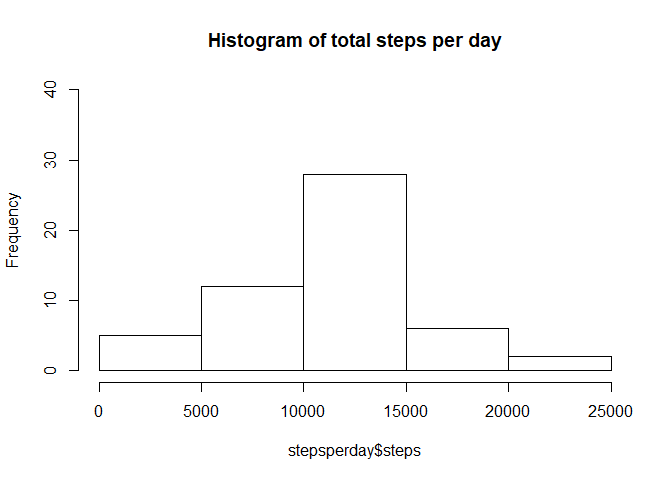
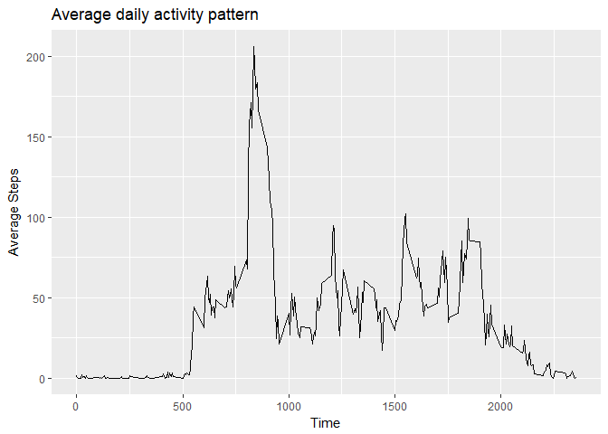
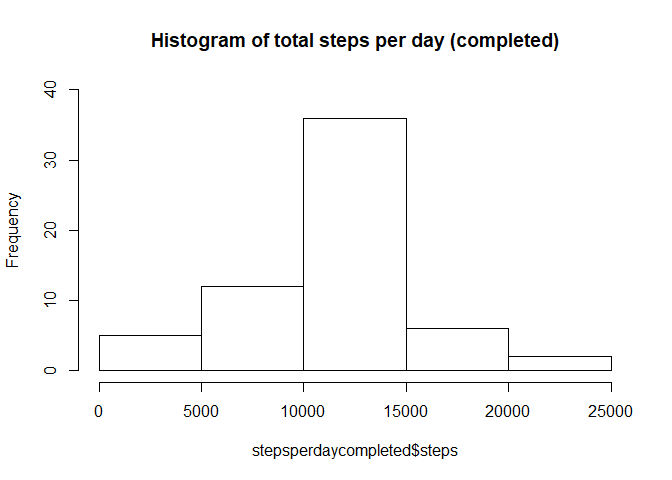
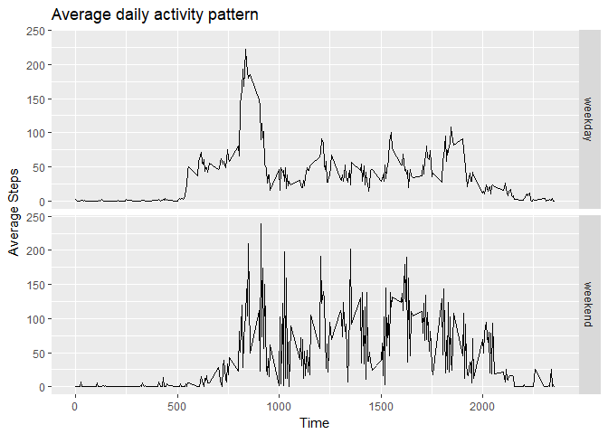

# Reproducible Research: Peer Assessment 1


```
## 
## Attaching package: 'dplyr'
```

```
## The following objects are masked from 'package:stats':
## 
##     filter, lag
```

```
## The following objects are masked from 'package:base':
## 
##     intersect, setdiff, setequal, union
```

## Loading and preprocessing the data


```r
setwd("~/DataScience/Reproducible Research")
activitydata <- read.csv(unz("activitydata.zip", "activity.csv"), sep=",")
activitydata$date <- as.Date(activitydata$date, "%Y-%m-%d")
```


## What is mean total number of steps taken per day?

```r
stepsperday <- activitydata %>%   group_by(date) %>%   summarise(steps = sum(steps))
hist(stepsperday$steps, main="Histogram of total steps per day" , ylim=c(0,40))
```

<!-- -->

```r
meanstepsperday <- round(mean(stepsperday$steps, na.rm=TRUE),2)
medianstepsperday <- round(median(stepsperday$steps, na.rm=TRUE),0)
```
The mean of total number of steps taken per day is 1.076619\times 10^{4}
The median of total number of steps taken per day is 1.0765\times 10^{4}


## What is the average daily activity pattern?


```r
avgstepsperinterval <- activitydata %>%   group_by(interval) %>%   summarise(steps = mean(steps, na.rm=TRUE))
ggplot(avgstepsperinterval, aes(x=interval, y=steps)) + geom_line() +  labs(title ="Average daily activity pattern", x = "Time", y = "Average Steps") 
```

<!-- -->

```r
maxinterval <- avgstepsperinterval[avgstepsperinterval$steps == max(avgstepsperinterval$steps),1]
maxsteps <- avgstepsperinterval[avgstepsperinterval$steps == max(avgstepsperinterval$steps),2]
```
On average across all the days the maximum number of steps is taken in the 5-minute interval at 835
The average number of steps taken in this interval is 206.1698113

## Imputing missing values


```r
totalmissing <- sum(is.na(activitydata))

activitydatacompleted <- activitydata

activitydatacompleted[is.na(activitydatacompleted$steps),"steps"] <- round(avgstepsperinterval[match(activitydatacompleted$interval, avgstepsperinterval$interval), 2])
```

```
## Warning in `[<-.data.frame`(`*tmp*`, is.na(activitydatacompleted$steps), :
## replacement element 1 has 17568 rows to replace 2304 rows
```

```r
stepsperdaycompleted <- activitydatacompleted %>%   group_by(date) %>%   summarise(steps = sum(steps))
hist(stepsperdaycompleted$steps, main="Histogram of total steps per day (completed)" , ylim=c(0,40))
```

<!-- -->

```r
hist(stepsperday$steps, main="Histogram of total steps per day" , ylim=c(0,40))
```

<!-- -->

```r
meanstepsperdaycomplete <- mean(stepsperdaycompleted$steps, na.rm=TRUE)
medianstepsperdaycomplete <- median(stepsperdaycompleted$steps, na.rm=TRUE)
```
Total number of missing values in the dataset is 2304
The mean of total number of steps taken per day (completed dataset) is 1.0765639\times 10^{4}
The median of total number of steps taken per day (completed dataset) is 1.0762\times 10^{4}


## Are there differences in activity patterns between weekdays and weekends?


```r
activitydata$weekday = "" 
activitydata$weekday <- weekdays(activitydata$date)

activitydata[activitydata$weekday!=c("Saturday", "Sunday"), "weekday"] <- "weekday"
activitydata[activitydata$weekday==c("Saturday", "Sunday"), "weekday"] <- "weekend"
activitydata$weekday <- as.factor(activitydata$weekday)

avgstepsperinterval1 <- activitydata %>%   group_by(interval,weekday) %>%   summarise(steps = mean(steps, na.rm=TRUE))

p<- ggplot(avgstepsperinterval1, aes(x=interval, y=steps)) + geom_line() + facet_grid(weekday~.)
p <- p + labs(title ="Average daily activity pattern", x = "Time", y = "Average Steps") 
p
```

<!-- -->
Average number of steps during weekends are generally lower except between 0730 and 1000 hours. 


